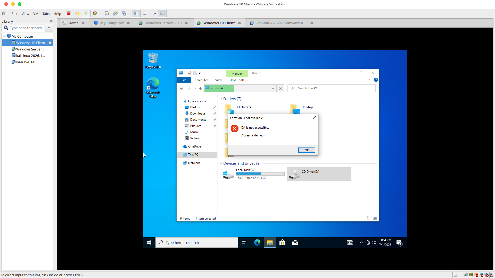
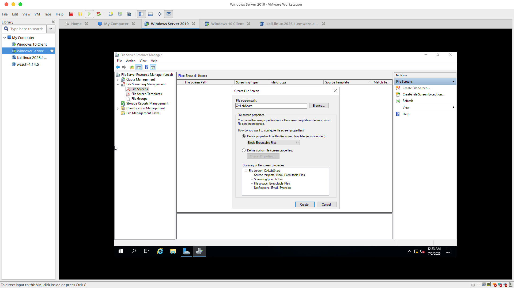

# Windows Enterprise Sandbox: Endpoint Hardening & File Governance Lab

## 📌 Project Overview
This project demonstrates the deployment, configuration, and structural hardening of an isolated corporate network infrastructure utilizing a Windows Server 2019 Domain Controller and a Windows 10 Enterprise endpoint. The objective of this hands-on lab was to implement strict data governance policies, reduce endpoint vulnerability vectors, and mitigate the risk of malicious file propagation across network resources.

---

## 🛠️ Skills & Technologies Demonstrated
* **Hypervisor Architecture:** VMware Workstation (64-bit Core Optimization & Custom LAN Segmentation)
* **Directory Services:** Active Directory Domain Services (AD DS) & Domain Architecture Join Handshakes
* **Endpoint Hardening:** Group Policy Objects (GPOs) & Active Removable Storage Class Restrictions
* **Data Governance & Security:** File Server Resource Manager (FSRM) & Real-Time Active File Screening
* **Networking Foundations:** Static Subnetting, Custom IPv4 Configurations, and Isolated Virtual Switch Routing

---

## 🏗️ Architecture & Network Design
To ensure full security isolation from host and production networks, all assets were deployed onto a dedicated VMware virtual switch network loop.

* **Domain Name:** `css.com`
* **Domain Controller (Windows Server 2019):**
  * **Hostname:** `CSS-SERVER`
  * **Static IP Address:** `192.168.1.10`
  * **Subnet Mask:** `255.255.255.0`
  * **DNS Loopback Mapping:** `127.0.0.1`
* **Enterprise Endpoint (Windows 10 Client):**
  * **Hostname:** `WIN10-CLIENT`
  * **Static IP Address:** `192.168.1.20`
  * **Subnet Mask:** `255.255.255.0`
  * **Target Domain DNS Pointer:** `192.168.1.10`

---

## 🚀 Implementation Milestones

### Phase 1: Subnet Infrastructure & Core Active Directory Deployment
1. Provisions were established for a secure, localized directory path by installing **Active Directory Domain Services (AD DS)** on `CSS-SERVER`.
2. Created a dedicated standard user profile (`lab`) inside Active Directory Users and Computers (ADUC).
3. Optimized lab workflows by modifying the **Default Domain Policy** via the Group Policy Management Editor to streamline password complexity parameters for development efficiency.
4. Corrected cross-subnet isolation limits by shifting both VMs onto a localized **VMware LAN Segment** and assigning matching manual IPv4 structural identities.
5. Successfully initiated a network handshake and registered the `WIN10-CLIENT` workstation into the `css.com` domain.

### Phase 2: Endpoint Hardening via Removable Storage Access Controls
To guard against weaponized USB attacks, data exfiltration, or rogue virus injection, systemic workstation controls were established.
1. Drilled down to the system policies path via the Group Policy Management Editor:
   `Computer Configuration` ➡️ `Policies` ➡️ `Administrative Templates` ➡️ `System` ➡️ `Removable Storage Access`
2. Configured and activated the restriction rule: **"All Removable Storage classes: Deny all access"**.
3. Enforced immediate domain distribution using the administrative execution command: `gpupdate /force`.
4. **Validation Outcome:** Attempting to access or alter storage mount structures while logged in under the standard domain user account resulted in a definitive system-level `Access is Denied` lockout.

### Phase 3: Network Share Deployment & FSRM Ransomware Mitigation
Implemented real-time structural screening to block standard network users from storing or executing dangerous payload extensions (`.exe`, `.bat`) inside enterprise shared storage folders.
1. Provisioned a network file system container named `LabShare` on the server root drive, adjusting file configuration permissions explicitly to `Everyone: Read/Write`.
2. Installed and deployed the **File Server Resource Manager (FSRM)** server role feature via Server Manager.
3. Configured an active monitoring boundary mapping to `C:\LabShare` and appended the out-of-the-box rule structural block: **"Block Executable Files"**.
4. **Validation Outcome:** While common data variants (such as `.txt` strings) saved without interruption, attempting to write, rename, or drop an executable profile (`malware.exe`) triggered an immediate, real-time operating system interception barrier.

---

### 📊 Verification & Visual Evidence

#### 1. Active Directory Domain Handshake Completion

#### 2. Endpoint Hardening: USB Flash Drive Access Restriction

#### 3. Endpoint Hardening: Restricted Standard User Access Interface Block

#### 4. File Server Configuration & FSRM Deployment

#### 5. Real-Time Active File Screening Interception

